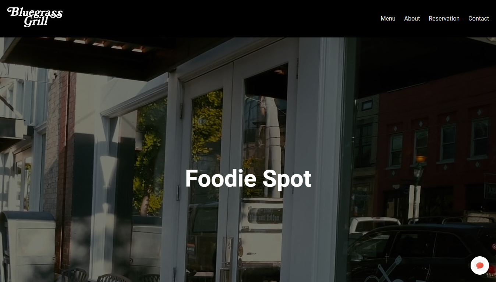

# 🍽️ Bluegrass Grill – Simple Restaurant Website

Welcome to **Bluegrass Grill**, a beautifully designed static restaurant website built entirely using **HTML** and **CSS**. This project is perfect for showcasing a small food business or café with a clean and modern UI.

> 🚀 Project Status: Intermediate Level | Responsive | Static | Non-Responsive

---

## ✨ Features

- 🖼️ Full-screen hero section with branding
- 🍕 Menu section showcasing popular dishes with prices
- 📖 About Us section explaining the restaurant’s story
- 📞 Contact information including location, email & phone
- 📅 Table reservation form (UI only, no backend)
- 🕓 Opening hours section for customer convenience

---

## 💻 Tech Stack

- HTML5  
- CSS3
- JavaScript

---

## 📸 Screenshots

### 🏠 Homepage


---

## 🚧 Future Improvements

- Make the website responsive for all screen sizes
- Add JavaScript form validation and interactivity
- Connect to backend for real table reservations
- Implement a dynamic menu using JSON or APIs
- Include Google Maps embed for location access

---

## 📦 Installation (for Local Preview)

```bash
1. Clone the repository:
   git clone https://github.com/your-username/bluegrass-grill.git

2. Navigate to the project folder:
   cd bluegrass-grill

3. Open `index.html` in your browser.
```

## 📬 Contact
📧 thiagarajandeepu2007@gmail.com
📞 +91 63832 63688

## 🙌 Credits
Built with ❤️ by Deepak B T
